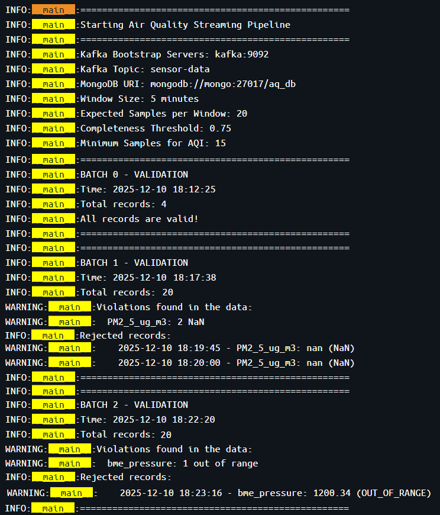

# Air Quality stream processing pipeline

A fully containerized **data engineering** project for real-time monitoring and analysis of urban air quality. This pipeline simulates IoT sensors, streams environmental data through **Kafka** and **Spark Structured Streaming**, stores and aggregates data in **MongoDB**, manages retention policies with **Airflow**, and visualizes metrics using **Prometheus** and **Grafana**.

## Project Structure

```bash
├── airflow/
│   ├── dags/                           
│   │   └── data_retention.py           # Airflow DAG to handle data retention
│   ├── requirements.txt                # Python dependencies for Airflow container
│   └── Dockerfile                      # Dockerfile to build Airflow image with required dependencies
│
├── spark-apps/
│   ├── stream_processing.py            # PySpark script for real-time stream processing from Kafka
│   ├── start-spark.sh                  # Script to launch Spark jobs in container
│   ├── spark-jmx.yaml                  # JMX metrics configuration for Spark monitoring
│   └── Dockerfile                      # Dockerfile to build Spark image with connectors 
│
├── sensors/
│   ├── Dockerfile                      # Dockerfile to build sensor simulator container
│   ├── requirements.txt                # Python dependencies for sensor simulator
│   ├── sensor_data.csv                 # Sample or test sensor data used by the simulator
│   └── stream_producing.py             # Script to simulate sensors and publish data to Kafka
│
├── prometheus/
│   └── prometheus.yml                  # Prometheus configuration for scraping metrics
│
├── grafana/
│   ├── dashboards/                     # Folder containing Grafana dashboards in JSON format
│   │   ├── air-quality_dashboard.json  # Dashboard for visualizing air quality metrics
│   │   ├── kafka-dashboard.json        # Dashboard for monitoring Kafka metrics
│   │   ├── mongo-dashboard.json        # Dashboard for monitoring MongoDB metrics
│   │   └── spark-dashboard.json        # Dashboard for monitoring Spark metrics
│   └── provisioning/                   # Grafana provisioning folder
│       ├── dashboards/                 
│       │   └── dashboard.yml           # Dashboard provisioning configuration
│       └── datasources/               
│           └── datasource.yml          # Data source definition for Grafana 
│
├── mongo-data/                         # Folder to persist MongoDB data
│
├── img/                                # Folder containing images for documentation
│
├── docker-compose.yml                  # Docker Compose file to orchestrate the full pipeline
├── EDA.ipynb                           # Jupyter notebook for exploratory data analysis
└── README.md                           # Project documentation
```

## Project Overview

Sensors installed in a city measure various environmental parameters:

- **PM10 (µg/m³)**
- **PM2.5 (µg/m³)**
- **Pressure**
- **Temperature**
- **Humidity**
- **CO (ppm)**
- **NO₂ (ppm)**
- **O₃ (ppb)**

These measurements (sourced from [Kaggle Dataset](https://www.kaggle.com/datasets/leonardocosmote/air-quality-and-environmental-dataset-outdoor-1yr)) are streamed, processed, aggregated, and analyzed automatically.

### Air Quality Index (AQI) Calculation

The Air Quality Index (AQI) is a standardized indicator that converts pollutant concentrations into a scale describing the health impact of air quality.

### Reference Standards

This project follows the **U.S. EPA (Environmental Protection Agency)** methodology, as described in:
- [Technical Assistance Document for the Reporting of Daily Air Quality – the Air Quality Index (AQI) (EPA-454/B-24-002 2024)](https://document.airnow.gov/technical-assistance-document-for-the-reporting-of-daily-air-quailty.pdf)

### Formula

For each pollutant, the sub-index $I_p$
is calculated as:
$$
I_p = \frac{I_{HI} - I_{LO}}{BP_{HI} - BP_{LO}} \times (C_p - BP_{LO}) + I_{LO}
$$
Where:
- $C_p$ = observed concentration of pollutant *p*
- $BP_{HI}$, $BP_{LO}$ = upper and lower breakpoint concentrations for *p*
- $I_{HI}$, $I_{LO}$= corresponding AQI values for those breakpoints

The **overall AQI** is the **maximum of all sub-indices**:
$$
AQI = \max(I_{PM2.5}, I_{PM10}, I_{NO2}, I_{O3}, I_{CO})
$$

### U.S. EPA Breakpoints

| Category | AQI Range | PM2.5 (µg/m³) | PM10 (µg/m³) | NO₂ (ppm) | O₃ (ppb) |
|-----------|-----------|---------------|---------------|-------------|---------------|
| 🟢 Good | 0–50 | 0.0–12.0 | 0–54 | 0.000–0.053 | 0–54 |
| 🟡 Moderate | 51–100 | 12.1–35.4 | 55–154 | 0.054–0.100 | 55–70 | 
| 🟠 Unhealthy for Sensitive Groups | 101–150 | 35.5–55.4 | 155–254 | 0.101–0.360 | 71–85 | 
| 🔴 Unhealthy | 151–200 | 55.5–150.4 | 255–354 | 0.361–0.649 | 86–105 | 
| 🟣 Very Unhealthy | 201–300 | 150.5–250.4 | 355–424 | 0.650–1.249 | 106–200 |
| ⚫ Hazardous | 301–500 | 250.5–500.4 | 425–604 | 1.250+ | 201+ | 

---

## System Architecture


The system follows a Kappa streaming architecture, that is composed of five layers, each performing a different function:

|Layer	|Technology	|Purpose|
|---|---|---|
|Data Ingestion|	Apache Kafka (KRaft)|	A Python script was written to stream this data every 15 seconds to a “sensor_data” topic via Apache Kafka in KRaft mode. KRaft mode provides improved fault-tolerance and scalability.
|Stream Processing	|Apache Spark Streaming|	Calculates AQI over a 5-minute aggregation window instead of 1-hour window in order to allow faster observation of system behavior. Late-arriving data are handled using event-time watermarking, allowing Spark to include late measurements within a 5-minute threshold. Data completeness is ensured by requiring at least 75% of the expected samples within each interval. Schema and value range validation is performed here, where incoming sensor measurements are checked against defined schema and acceptable thresholds.
|Persistence	|MongoDB|	aq_db stores data in two collections: raw_collection for raw measurements and agg_collection for aggregated AQI outputs. 
|Orchestration	|Apache Airflow|	Enforces a 30-day data retention policy.
|Monitoring|	Prometheus, Grafana|	Collects metrics from each service and visualizes them in custom dashboards, supporting maintainability and observability.

The complete system was containerized using Docker Compose to ensure portability and reproducibility

Air quality Grafana dashboard 


### **Database:** `aq_db`

- `raw_collection` -> raw data from Kafka (every 15 seconds)  
- `agg_collection` -> hourly aggregates and calculated AQI  

### **Data Validation**

The system performs three levels of validation:

1. Schema Validation: Ensures JSON structure matches expected format:

```json
{
    "type": "object",
    "properties": {
        "event_time": {"type": "string", "format": "date-time"},
        "PM10_ug_m3": {"type": "number"},
        "PM2_5_ug_m3": {"type": "number"},
        "bme_pressure": {"type": "number"},
        "temperature": {"type": "number"},
        "humidity": {"type": "number"},
        "CO_ppm": {"type": "number"},
        "NO2_ppm": {"type": "number"},
        "O3_ppb": {"type": "number"}
    },
    "required": ["event_time"],
    "additionalProperties": false
}
```
2. Range Validation: Checks sensor values against physical limits

|Parameter|	Min|	Max|	Unit|	Description|
|---------|----------|------|-----|--------------|
|PM10_ug_m3|	0|	1000|	μg/m³|	Particulate Matter| 10|
|PM2_5_ug_m3|	0|	500|	μg/m³|	Particulate Matter 2.5|
|bme_pressure|	800|	1100|	hPa|	Atmospheric Pressure|
|temperature|	-40|	60|	°C|	Temperature|
|humidity|	0|	100|	%|	Relative Humidity|
|CO_ppm|	0|	50|	ppm|	Carbon Monoxide|
|NO2_ppm|	0|	1|	ppm|	Nitrogen Dioxide|
|O3_ppb|	0|	500|	ppb|	Ozone|

3. Completeness Validation: Requires 75% valid samples per window

Validation results are available in spark container logs:



## Usage

0. **Prerequisites**

- Docker & Docker Compose
- Python 3.11+

1. **Download the zip folder with the project and unzip it**

> [!NOTE]
> In case of clonning the repo, change the encoding of the start-spark.sh file from CRLF to LF.

3. **Start the system:**

```docker-compose up --build```

3. **Access:**

Service    	 |URL	                 |Credentials        |
|------------|---------------------|-------------------|
Mongo Express|http://localhost:8088|admin / admin      |
Airflow	     |http://localhost:8080|admin / admin      |
Grafana    	 |http://localhost:3000|admin / admin      |
Prometheus   |http://localhost:9090|-                  |
Spark        |http://localhost:4040|-                  |

4. **Stop**

```docker-compose down -v``` 


